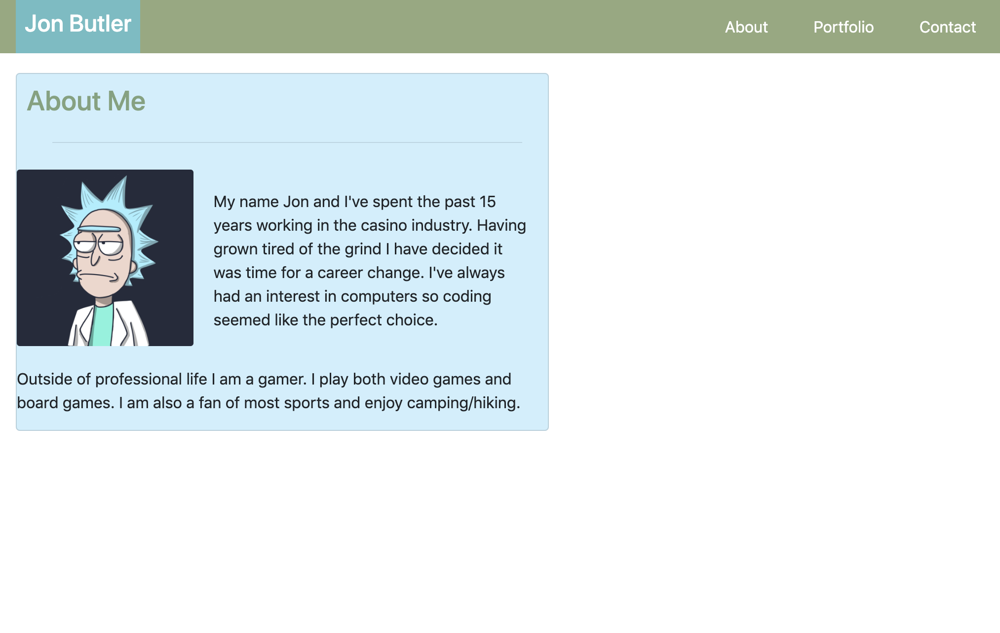

# ProfilePage

https://jbdunks.github.io/ProfilePage/

Tasked with making a profile page consisting of an index.html, a portfolio page, and a contact page. The page is to serve are a future portfolio for projects and assignments completed in class.

<<<<<<< HEAD

=======

>>>>>>> 1035d1f363d1522b0c6ad52203fd07022f088950
